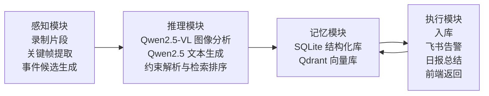
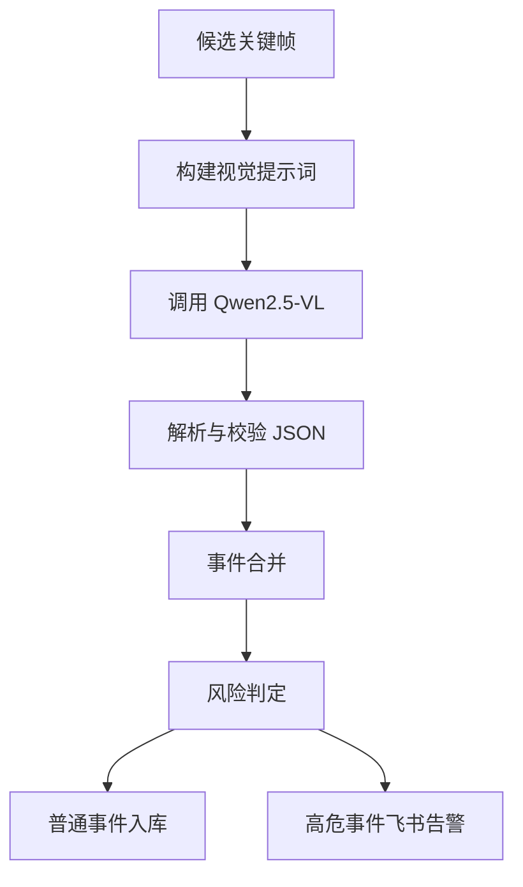
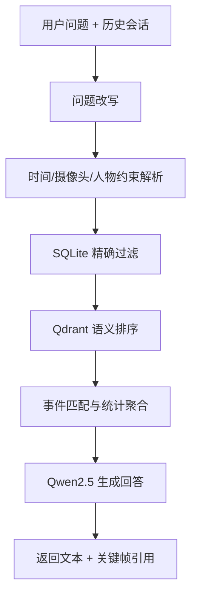

# 智能体设计

## 1. 设计目标

本项目中的智能体并不是一个简单的“调用一次大模型”的脚本，而是一套围绕视频安防场景构建的多节点工作流系统。它的目标是：

- 对关键帧进行结构化理解
- 对历史事件形成可检索记忆
- 对用户问题做约束解析与检索推理
- 对高危事件执行告警动作
- 对日常事件执行入库和总结动作

因此，智能体设计的核心并不是“单次生成”，而是：

`感知 -> 推理 -> 记忆 -> 执行`

## 2. 为什么采用智能体架构

如果只用普通脚本串联模型调用，系统会很快遇到几个问题：

- 中间状态难以跟踪
- 不同类型问题难以分支处理
- 图像分析、文本问答、向量检索之间难以清晰协同
- 后续新增语音、人员知识库时扩展成本高

因此，项目采用 `LangGraph` 来组织智能体层，把整个系统从“多个函数调用”升级为“可追踪、可扩展的状态化工作流”。

## 3. 智能体总体结构

智能体内部可划分为四个功能模块：

1. 感知模块
2. 推理模块
3. 记忆模块
4. 执行模块

这一结构不是单向流水线，而是闭环结构：

- 感知模块先产生事件候选
- 推理模块先对候选事件做结构化判断
- 记忆模块保存推理后的结构化结果，供后续检索和复用
- 执行模块根据结果决定入库、告警、总结和前端返回
- 执行结果会继续写回记忆层，形成长期闭环

## 4. 感知模块

感知模块负责从视频中发现值得分析的画面。由于当前项目不强调逐帧实时分析，因此采用片段化处理方式。

### 4.1 输入

- 摄像头 RTSP 视频流
- 或已经录制好的 MP4 视频片段

### 4.2 处理过程

- 使用 OpenCV 读取视频片段
- 做运动检测和背景变化判断
- 在滑动窗口内选择代表性峰值帧
- 过滤掉大量静态、重复、无意义的画面
- 将时间上相近的关键帧归并为候选事件

### 4.3 输出

- 候选关键帧列表
- 关键帧时间戳
- 事件窗口起止时间
- 代表帧集合

当前对应实现主要在：

- [smart_extractor.py](C:\Users\chens\Desktop\camera_project\smart_extractor.py)
- [camera_recorder.py](C:\Users\chens\Desktop\camera_project\camera_recorder.py)
- [monitoring_analysis.py](C:\Users\chens\Desktop\camera_project\monitoring_analysis.py)

## 5. 推理模块

推理模块是智能体的大脑，负责把事件候选、历史记忆和用户问题转化为最终可执行的判断。

### 6.1 图像推理

图像推理主要由 `Qwen2.5-VL` 负责。

处理步骤如下：

1. 根据关键帧构建中文视觉提示词
2. 调用视觉模型分析画面
3. 输出结构化 JSON
4. 用 Pydantic 校验字段
5. 生成标准化事件结果

结构化字段包括：

- `risk_level`
- `description`
- `anomaly_type`
- `person_present`
- `person_count`
- `action_type`
- `upper_clothing_color`
- `lower_clothing_color`
- `confidence`

### 6.2 文本推理

文本推理主要由 `Qwen2.5` 负责。

它并不直接猜答案，而是基于以下输入进行生成：

- 用户问题
- 约束解析结果
- SQLite 精确筛选结果
- Qdrant 语义检索结果
- 规则统计结果

这意味着问答中的“数量”“时间”“摄像头”等信息尽可能来自结构化检索，而不是直接交给模型自由发挥。

### 6.3 检索与聚合

推理模块中还包括检索与统计逻辑，主要负责：

- 识别问题类型
  - 统计类
  - 存在性查询类
  - 列表汇总类
  - 总结类
- 解析时间表达
  - 今天、昨天、上周、上周四、某月某日等
- 解析摄像头和人物条件
- 做 SQLite 精确过滤
- 做 Qdrant 语义排序
- 对结果做匹配和聚合

当前对应实现主要在：

- [monitoring_query.py](C:\Users\chens\Desktop\camera_project\monitoring_query.py)
- [monitoring_summary.py](C:\Users\chens\Desktop\camera_project\monitoring_summary.py)
- [monitoring_prompts.py](C:\Users\chens\Desktop\camera_project\monitoring_prompts.py)

## 6. 记忆模块

记忆模块负责把推理结果保存为后续可复用的知识。

### 6.1 结构化记忆

项目使用 `SQLite` 作为结构化事件数据库，保存：

- 任务信息 `tasks`
- 摄像头录制信息 `camera_runs`
- 关键帧事件信息 `events`
- 每日总结信息 `summaries`

其中 `events` 是最核心的表，包含：

- 事件时间
- 摄像头编号
- 风险等级
- 描述
- 动作类型
- 人数
- 衣着颜色
- 关键帧路径
- 视频片段路径

### 6.2 语义记忆

项目使用 `Qdrant` 保存事件文本向量，支持：

- 黑衣人员
- 是否有人徘徊
- 某时段是否有人出现
- 某个相似事件是否出现过

这种语义记忆为自然语言问答和后续人员知识库提供了基础。

当前对应实现主要在：

- [event_store.py](C:\Users\chens\Desktop\camera_project\event_store.py)
- [vector_store.py](C:\Users\chens\Desktop\camera_project\vector_store.py)
- [embedding_client.py](C:\Users\chens\Desktop\camera_project\embedding_client.py)

## 7. 执行模块

执行模块负责把推理结果转化为系统动作。

当前执行动作主要有三类：

### 7.1 入库

普通事件会写入 SQLite，并同步写入 Qdrant，用于后续问答和总结。

### 7.2 告警

高危事件会触发飞书告警，推送：

- 风险等级
- 事件描述
- 关键帧图片
- 时间和摄像头信息

### 7.3 总结

系统会基于每日事件自动生成：

- 早晨总结
- 下午总结
- 晚上总结
- 凌晨总结
- 全天综合总结

执行模块对应实现主要在：

- [feishu_agent.py](C:\Users\chens\Desktop\camera_project\feishu_agent.py)
- [monitoring_summary.py](C:\Users\chens\Desktop\camera_project\monitoring_summary.py)
- [monitoring_service.py](C:\Users\chens\Desktop\camera_project\monitoring_service.py)

## 8. LangGraph 在智能体中的作用

当前项目中，LangGraph 的作用不是替代模型，而是负责管理整个智能体工作流。

### 8.1 适合多节点流程

本项目天然包含多个节点：

- 关键帧分析
- JSON 解析校验
- 事件合并
- 风险分级
- 数据写入
- 问题改写
- 约束提取
- 检索排序
- 回答生成
- 总结生成

LangGraph 适合把这些节点组织成图结构。

### 8.2 适合条件分支

例如：

- 高危事件 -> 飞书告警分支
- 普通事件 -> 入库分支
- 模型失败 -> 降级分支
- 统计型问答 -> SQL 优先分支
- 模糊语义问答 -> 向量检索分支

### 8.3 适合状态传递

每一步都可以在 state 中保存中间结果，例如：

- 当前问题
- 时间约束
- 摄像头约束
- 检索候选集
- 统计结果
- 最终回答

这使得系统更容易调试、更容易回溯，也更容易后续扩展。

## 9. 当前智能体的两类核心工作流

### 9.1 工作流 A：关键帧分析

### 9.2 工作流 B：自然语言监控对话

## 10. 当前智能体设计的优势

### 10.1 比普通脚本更可维护

- 节点职责清晰
- 状态流清晰
- 分支逻辑清晰
- 后续扩展不需要把所有逻辑继续堆到一个函数里

### 10.2 比纯大模型方案更可控

- 统计类问题优先依赖 SQLite 精确结果
- 模糊查询才依赖向量检索
- 回答由规则层与模型层共同控制
- 降低“模型自由发挥导致答非所问”的风险

### 10.3 比纯规则系统更灵活

- 能处理自然语言问题
- 能处理模糊语义检索
- 能从图像中抽取 richer 的画面语义
- 能持续积累本地知识

## 11. 后续智能体扩展方向

后续智能体层将继续扩展两类能力：

### 11.1 语音入口

在智能体前面增加：

- 麦克风
- 唤醒词检测
- 语音识别
- TTS 播报

这样用户可以直接问：

- 今天有没有谁来过？
- 今天有没有陌生人徘徊？
- 今天我有没有出现过？

### 11.2 人员知识库

在当前事件库基础上扩展：

- 人员档案
- 人员特征描述
- 历史出现轨迹
- 事件与人员的匹配关系

这样智能体就不再只回答“发生了什么”，而能逐步回答：

- 这个人是谁？
- 这个人今天有没有出现？
- 这个人上周是否也来过？

## 12. 一句话总结

本项目中的智能体本质上是一套：

`以 LangGraph 为编排核心、以 Qwen2.5-VL 和 Qwen2.5 为推理核心、以 SQLite + Qdrant 为记忆核心、以告警与问答为执行输出的多模态安防智能体。`
