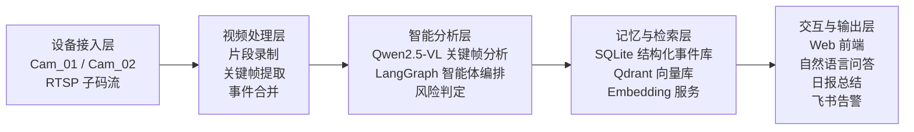
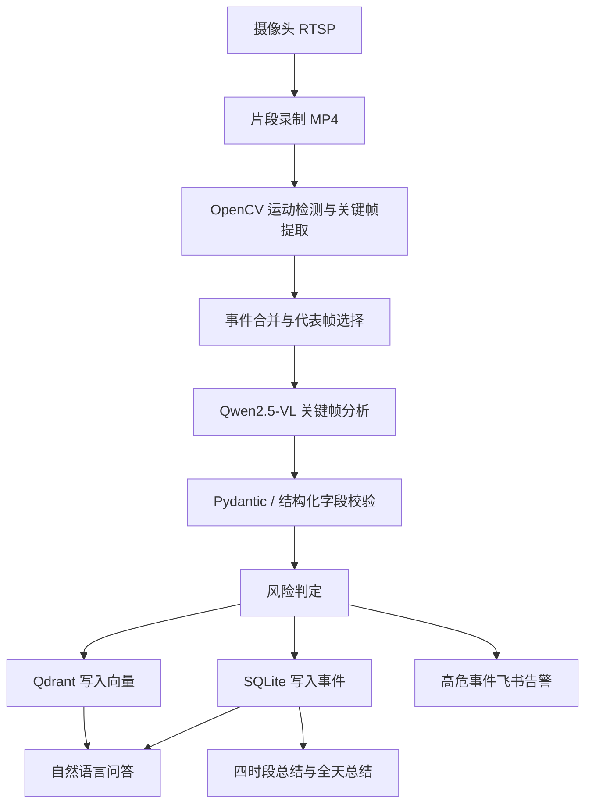

# 总系统架构

## 1. 架构目标

本项目面向研究院安防场景，目标是构建一套基于多模态大模型与本地知识库的视频监控智能系统。系统需要同时满足以下要求：

- 支持两路网络摄像头接入与片段录制
- 支持关键帧提取与异常事件分析
- 支持高危事件即时告警
- 支持自然语言检索历史监控记录
- 支持全天日志总结与研判输出
- 支持后续扩展语音交互与人员知识库

当前系统的核心设计原则是：`摄像头采集、结构化事件、语义检索、智能体编排、前端交互` 五层协同。

## 2. 总体架构分层

从左到右，系统可以划分为五个核心层次：

1. 设备接入层
2. 视频处理层
3. 智能分析层
4. 记忆与检索层
5. 交互与输出层

## 3. 各层职责说明

### 3.1 设备接入层

设备接入层负责从研究院内网中接入两路网络摄像头视频流。当前摄像头通过 RTSP 子码流提供低分辨率视频，用于本地分析与事件检测。

该层的职责包括：

- 维护摄像头的 `camera_id`、名称、RTSP 地址、账号密码等配置
- 与摄像头建立稳定连接
- 为后续录制与预览提供视频源

当前实现中，该层主要由以下文件承担：

- [camera_recorder.py](C:\Users\chens\Desktop\camera_project\camera_recorder.py)
- [camera_config.json](C:\Users\chens\Desktop\camera_project\camera_config.json)
- [camera_config.local.json](C:\Users\chens\Desktop\camera_project\camera_config.local.json)

### 3.2 视频处理层

视频处理层负责把连续的视频流转化为可供大模型分析的关键事件片段。由于本项目当前并不强调逐帧实时分析，因此采用“分段录制 + 片段抽帧”的策略。

该层的职责包括：

- 将 RTSP 流按固定时长录制为 MP4 片段
- 基于 OpenCV 做运动检测
- 在滑动窗口中选择代表性的峰值帧
- 对重复帧进行过滤
- 把时间上相近、语义上相似的关键帧合并为同一事件

当前实现中，该层主要由以下文件承担：

- [camera_recorder.py](C:\Users\chens\Desktop\camera_project\camera_recorder.py)
- [smart_extractor.py](C:\Users\chens\Desktop\camera_project\smart_extractor.py)
- [monitoring_analysis.py](C:\Users\chens\Desktop\camera_project\monitoring_analysis.py)

### 3.3 智能分析层

智能分析层是系统的核心。它接收关键帧或关键事件候选，将其发送给视觉大模型进行语义理解，并结合规则与状态机做风险判定和执行分支控制。

该层的职责包括：

- 构造视觉分析提示词
- 调用 `Qwen2.5-VL` 做画面理解
- 输出结构化 JSON 结果
- 对字段进行校验和规范化
- 合并同一事件的多帧分析结果
- 判断风险等级
- 决定是写入数据库还是触发飞书告警

当前实现中，该层主要由以下文件承担：

- [llm_client.py](C:\Users\chens\Desktop\camera_project\llm_client.py)
- [monitoring_analysis.py](C:\Users\chens\Desktop\camera_project\monitoring_analysis.py)
- [monitoring_service.py](C:\Users\chens\Desktop\camera_project\monitoring_service.py)
- [monitoring_prompts.py](C:\Users\chens\Desktop\camera_project\monitoring_prompts.py)

### 3.4 记忆与检索层

记忆与检索层负责把“看到了什么”转化为可复用的系统记忆，为自然语言问答、日报总结和后续人员知识库提供基础。

该层采用双存储结构：

- `SQLite`：保存结构化任务、录制、事件、总结数据
- `Qdrant`：保存事件描述的语义向量，用于模糊检索和 RAG

这一层的职责包括：

- 保存任务、摄像头录制、事件、总结四类结构化数据
- 保存事件文本向量
- 支持“先结构化过滤，再语义排序”的检索模式
- 为统计类问答提供精确数据源
- 为总结类问答提供上下文

当前实现中，该层主要由以下文件承担：

- [event_store.py](C:\Users\chens\Desktop\camera_project\event_store.py)
- [vector_store.py](C:\Users\chens\Desktop\camera_project\vector_store.py)
- [embedding_client.py](C:\Users\chens\Desktop\camera_project\embedding_client.py)
- [monitoring_query.py](C:\Users\chens\Desktop\camera_project\monitoring_query.py)
- [monitoring_summary.py](C:\Users\chens\Desktop\camera_project\monitoring_summary.py)

### 3.5 交互与输出层

交互与输出层是最终面向用户的部分，用于展示监控画面、关键帧分析结果、自然语言问答和日报总结。

该层的职责包括：

- 展示两路摄像头画面
- 展示按日期检索的关键帧时间轴和分析结果
- 提供自然语言对话窗口与历史对话记录
- 展示全天总结与分时段总结
- 将高危事件通过飞书推送到移动端

当前实现中，该层主要由以下文件承担：

- [app.py](C:\Users\chens\Desktop\camera_project\app.py)
- [templates/index.html](C:\Users\chens\Desktop\camera_project\templates\index.html)
- [static/js/script.js](C:\Users\chens\Desktop\camera_project\static\js\script.js)
- [static/css/style.css](C:\Users\chens\Desktop\camera_project\static\css\style.css)
- [feishu_agent.py](C:\Users\chens\Desktop\camera_project\feishu_agent.py)

## 4. 当前数据流

当前项目中的完整主链路如下：

## 5. 当前模型分工

当前项目已经形成明确的多模型分工：

- `Qwen2.5-VL`
  - 负责关键帧图像分析
  - 输出结构化画面描述、风险等级、人物属性、动作等字段

- `Qwen2.5`
  - 负责自然语言监控问答
  - 负责每日总结与总结润色

- `Qwen3-Embedding`
  - 负责把事件描述向量化
  - 为 Qdrant 提供检索向量

## 6. 当前系统特点

与传统“录视频 + 人工回看”的方案相比，当前系统具备以下特点：

- 不是直接把全量视频全部送给大模型，而是先做关键帧筛选
- 不是只做一次性分析，而是把事件沉淀进本地记忆库
- 不是只有视觉分析，还支持自然语言问答和日报总结
- 不是简单脚本拼接，而是由 LangGraph 组织的多节点智能体工作流
- 当前系统已形成“感知 -> 记忆 -> 推理 -> 执行”的闭环

## 7. 后续扩展方向

在当前总系统架构基础上，后续重点扩展方向包括：

- 接入大厅麦克风，形成语音唤醒入口
- 建设本地人员知识库
- 将事件记忆扩展到“人员档案 + 历史出现轨迹”
- 增强复杂时间表达、统计型问答和人员属性推理能力
- 进一步优化关键帧提取精度和事件合并策略

## 8. 一句话总结

本项目的总系统架构可以概括为：

`以研究院内网摄像头为输入，以关键帧分析为核心，以 SQLite + Qdrant 为记忆，以 LangGraph 智能体为编排，以问答、日报和告警为输出的本地化安防智能系统。`
